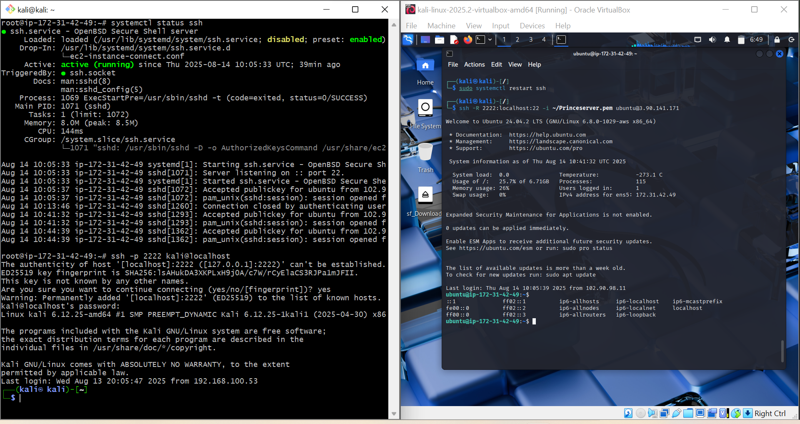
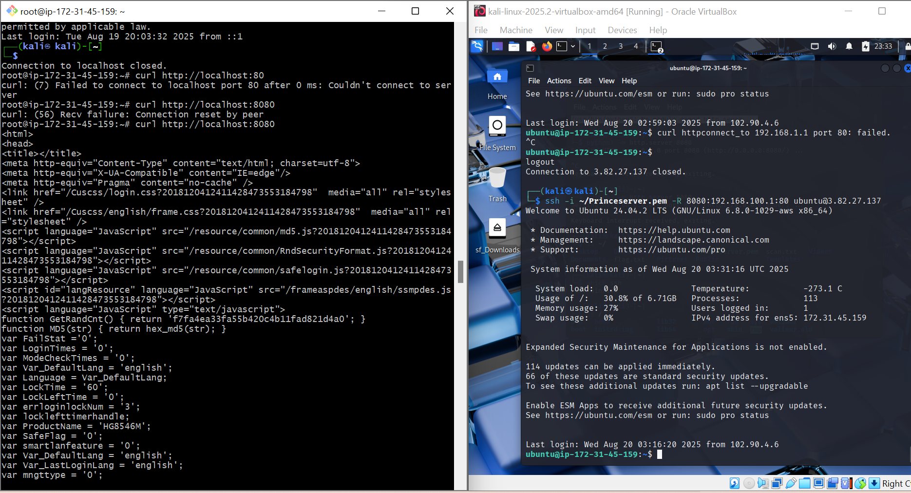
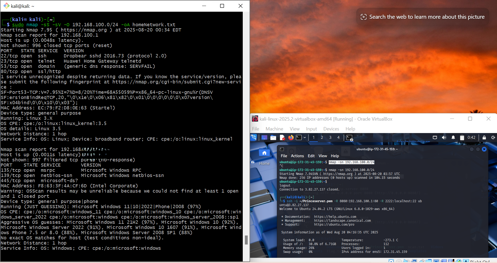

# ReconOps Lab – Reverse SSH Tunneling

<p align="center">Cloud-based reconnaissance lab for ethical hacking. This lab demonstrates Phase 1  of a penetration test, using AWS EC2 to perform Nmap and Whois scans for open-source intelligence gathering.</p> 

---

## Objective
The main objective of this project is to establish a **reverse SSH tunnel** between a **Kali VM (local network)** and an **EC2 instance (cloud)**.  
This setup allows the EC2 server to access and scan devices on Kali’s internal/home network, even though these devices are behind **NAT/Firewall** restrictions.

---

## Problem Statement
In real-world scenarios, most devices in a private LAN are hidden behind routers using **NAT (Network Address Translation)** and firewalls.

- This makes it impossible to directly connect or scan them from the outside (e.g., cloud servers).    
- Traditional inbound connections fail because there is no direct route back into the private LAN.  

**Solution:**  
A reverse tunnel is required — Kali (inside the NAT) must initiate an SSH connection to EC2 (publicly accessible).  
Once connected, EC2 can use the tunnel as a **bridge** to access Kali’s local network.

---

##  Key Insights

### 1. Mounting the Key File (PEM) Securely
- Shared folders in **VirtualBox** were used to transfer the EC2 key pair.  
- Proper file permissions were applied:
  ```bash
  chmod 400 ~/Princeserver.pem
  ```
- Without proper permissions, SSH rejects the key for security.

### 2. Reverse SSH Tunnel Command
From Kali → EC2:
```bash 
ssh -i key.pem -R 2222:localhost:22 -R 8080:localhost:80  ubuntu@<EC2-IP>
```
`-R 2222:localhost:22:` Forwards EC2 port 2222 to Kali’s SSH (port 22).  

`-R 8080:localhost:80:` Forwards EC2 port 8080 to Kali’s HTTP (port 80).


### 3. SSH Server Configuration on Kali
- Edited /etc/ssh/sshd_config: `AllowTcpForwarding yes`
- Restart SSH:
`sudo systemctl restart ssh`

### 4. Testing the Tunnel
From EC2, verify access to Kali’s services:

- SSH into Kali via local tunnel: `ssh -p 2222 kali@localhost`
- Access Kali’s web server: `curl http://localhost:8080`

### 5. Extending Access to the Entire LAN
Forward traffic to Kali’s gateway ( router at 192.168.100.1):
`ssh -i key.pem -R 8080:192.168.100.1:80 ubuntu@<EC2-IP>`
- Now EC2 can access the router’s web UI via:
`curl http://localhost:8080.`


---

### 6. Network Scanning from EC2
Run Nmap scans through the tunnel to probe internal devices:
`sudo nmap -sS -sV -O 192.168.100.1 -oN homeNetwork.txt`
- Scans are initiated from EC2 but target Kali’s LAN.


## Conclusion
This lab demonstrated how to:

- Securely share credentials into a Kali VM.  
- Use reverse SSH tunneling to bypass NAT/firewalls.  
- Forward multiple ports (SSH, HTTP) for remote access.  
- Extend access to other devices in the local network.  
- Perform network scanning from the cloud via the tunnel.  

 ## Takeaway
Reverse SSH tunneling is a powerful technique for:

- Red team operations (pivoting into internal networks).  
- Remote troubleshooting and administration.  
- Bridging isolated networks to cloud-based tools.  
This method enables external access to otherwise unreachable private resources—without opening inbound ports on the firewall.
